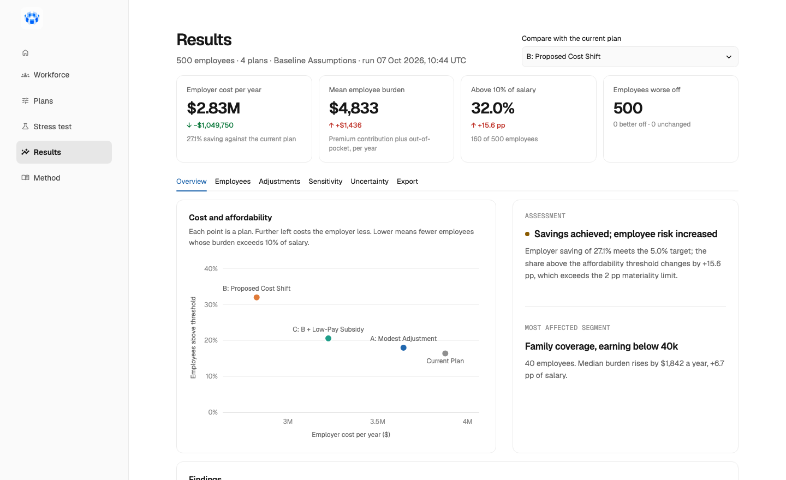
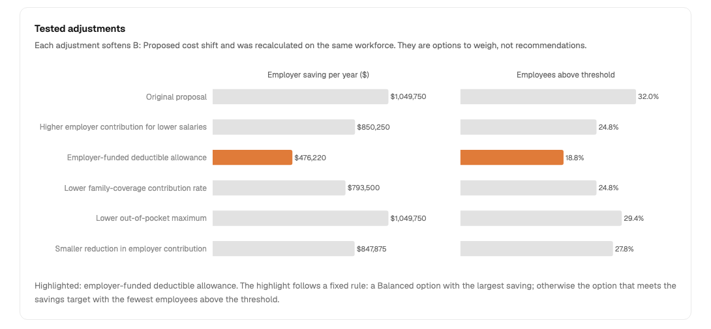
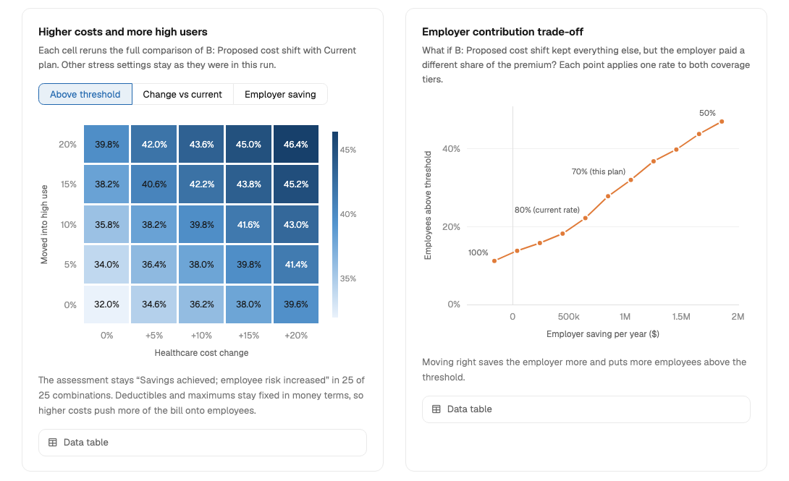

# Benefit Design Stress Lab

> Stress-test employee health-plan changes before they become employee problems.

Benefit Design Stress Lab is an interactive Python and Streamlit application for comparing employer health-plan scenarios. It estimates employer premium savings, models employee premium and out-of-pocket burden, identifies disproportionately affected workforce segments, and tests more balanced alternatives using fully synthetic demonstration data.



## The question it answers

> If an employer changes its health-benefit plan, how will the change affect company spending and the financial burden experienced by different employee groups?

An employer can lower its health-plan bill by paying a smaller share of the premium or by raising deductibles and cost sharing. Either way, employees pay part of the saving. Averages hide who pays most. This tool applies each plan to every employee and shows the saving next to the people who fund it.

It is built for a benefits consultant comparing designs, an HR or rewards analyst preparing a business case, or a finance partner weighing savings against workforce impact.

## Example

The demonstration compares a current plan with three alternatives on 500 synthetic employees. The affordability threshold is 10% of salary, a scenario parameter the user can change.

| Plan | Employer saving | Change in share above threshold | Assessment |
|---|---:|---:|---|
| A: Modest adjustment | 6.0% | +1.6 pp | Balanced |
| B: Proposed cost shift | 27.1% | +15.6 pp | Savings achieved; employee risk increased |
| C: B + low-pay subsidy | 16.8% | +4.2 pp | Savings achieved; employee risk increased |

Plan B saves the employer $1,049,750 a year. The average employee pays $1,436 more, which sounds manageable. The breakdown shows where it lands: employees with family coverage earning below $40,000 see their median burden rise by $1,842, or 6.7 percentage points of salary.

The app then tests fixes. An employer-funded allowance covering the rise in the deductible keeps 45% of the saving and cuts the share of employees above the threshold from 32.0% to 18.8%.



These are results from synthetic data under simplified rules. They illustrate the method and are not findings about any real workforce.

## What it does

- Generates a reproducible synthetic workforce, or validates an uploaded anonymised CSV
- Models one current plan and up to three alternatives, with employee-only and family tiers
- Calculates employer cost, employee premium contribution, out-of-pocket spending, and burden as a share of salary for every employee
- Reports results by salary band and coverage tier, and withholds figures for small groups
- Counts employees who are better off, unchanged, and worse off
- Labels each alternative against user-set objectives with transparent rules
- Recalculates five ways to soften a proposal and highlights one by a stated rule
- Stress-tests conclusions against higher healthcare costs, more high users, salary growth, and coverage-mix changes
- Exports aggregate results only



Not included: real insurer quotes, actuarial pricing, tax treatment, provider networks, co-payments, predictions of individual health, or automatic plan selection. There is no machine learning and no language model. The value is in formulas that can be read, checked, and tested.

## How it works

```text
Synthetic generator or validated CSV
                 │
                 ▼
        Workforce validation
                 │
                 ├──────────────┐
                 ▼              ▼
         Current plan      Alternative plans
                 │              │
                 └──────┬───────┘
                        ▼
            Cost calculation engine
                        │
              ┌─────────┴─────────┐
              ▼                   ▼
       Employer analysis   Employee analysis
              │                   │
              └─────────┬─────────┘
                        ▼
          Affordability and segment tests
                        │
                        ▼
        Dashboard + advisory summary + export
```

All calculations live in the `benefit_stress_lab` package and are covered by tests. The Streamlit pages only collect inputs and display what the package returns, so a layout change cannot alter a number.

### Core formulas

```text
employer premium contribution = annual premium × employer contribution %
employee premium contribution = annual premium − employer premium contribution

out-of-pocket spending = min( min(S, deductible)
                              + coinsurance % × max(S − deductible, 0),
                              out-of-pocket maximum )

total employee burden = employee premium contribution + out-of-pocket spending
burden percentage     = total employee burden ÷ annual salary × 100
```

`S` is the employee's allowed healthcare cost for the year. Each employee keeps the same `S` under every plan, so differences between plans come from plan design alone. [METHODOLOGY.md](METHODOLOGY.md) has the full method, every assumption, and a worked example.

### Data

| Workforce field | Example | Purpose |
|---|---|---|
| `employee_id` | `EMP-0001` | Synthetic identifier |
| `annual_salary` | `48000` | Affordability calculation |
| `salary_band` | `40k-59k` | Segment reporting |
| `coverage_tier` | `family` | Selects plan parameters |
| `age_band` | `35-44` | Reference only |
| `region` | `Region A` | Reference only |
| `utilisation_tier` | `medium` | Simplified spending scenario |
| `annual_allowed_cost` | `3200` | Modelled covered healthcare use |

| Plan field (per coverage tier) | Example |
|---|---:|
| Annual premium | 15,000 |
| Employer contribution | 80% |
| Deductible | 1,000 |
| Coinsurance | 20% |
| Out-of-pocket maximum | 6,000 |
| Employer allowance (optional) | 0 |

The synthetic workforce is drawn from explicit distributions with a fixed seed. Healthcare use is assigned independently of age, salary, and region: the model does not infer health from demographics. Synthetic data cannot prove real-world effectiveness. See [data/README.md](data/README.md).

## Run it

Requires Python 3.11 or later. The app runs in the browser on macOS, Windows, and Linux, and the tests run on all three on every push.

macOS and Linux:

```bash
git clone https://github.com/QBranch800/Employee-Benefit-Design-Stress-Lab.git
cd Employee-Benefit-Design-Stress-Lab
python3 -m venv .venv
source .venv/bin/activate
pip install -r requirements.txt
streamlit run app/app.py
```

Windows (PowerShell):

```powershell
git clone https://github.com/QBranch800/Employee-Benefit-Design-Stress-Lab.git
cd Employee-Benefit-Design-Stress-Lab
python -m venv .venv
.venv\Scripts\Activate.ps1
pip install -r requirements.txt
streamlit run app/app.py
```

Then choose **Load demonstration scenario** on the first page.

## Desktop app

The same app is packaged as an installable program for macOS and Windows. It carries its own Python, runs entirely on your computer, and opens in its own window. It listens only on your own machine, so nothing is exposed to the network.

| System | Installer | How to install |
|---|---|---|
| macOS (Apple silicon) | `BenefitDesignStressLab-macOS.dmg` | Open the disk image and drag the app to Applications |
| Windows 10 and 11 (64-bit) | `BenefitDesignStressLab-Setup.exe` | Run the installer. It adds a Start-menu entry and an optional desktop shortcut |

The `desktop` workflow builds both installers on GitHub, runs a self-test inside each packaged app, and attaches them to every [release](https://github.com/QBranch800/Employee-Benefit-Design-Stress-Lab/releases).

The installers are not code-signed, so the first launch shows a warning:

- **macOS:** Control-click the app and choose Open. On recent versions, go to System Settings → Privacy & Security and choose Open Anyway.
- **Windows:** choose More info, then Run anyway.

To build it yourself, run this on the system you want to target:

```bash
pip install -e ".[desktop]"
python desktop/build.py --check
```

The app and its installer appear in `dist/`. `--check` runs the packaged app's self-test: it loads the demonstration, runs the analysis, and renders the results page. The Windows installer step needs [Inno Setup 6](https://jrsoftware.org/isinfo.php). The Windows app uses the WebView2 runtime, which ships with Windows 11 and current Windows 10.

## Deploy as a web app

The repository is ready for [Streamlit Community Cloud](https://streamlit.io/cloud): create a new app, select this repository and the `main` branch, and set the main file to `app/app.py`. The dependencies in `requirements.txt` and the theme in `.streamlit/config.toml` are picked up automatically.

## Test it

```bash
pip install -e ".[dev]"
pytest
ruff check .
```

The suite has 142 tests. They cover the cost-sharing rules, five employees calculated by hand, boundary cases, upload validation, reconciliation of segment totals to workforce totals, the stress scenarios, the exports, and a smoke test of every page.

## Project layout

```text
app/                     Streamlit pages, charts, and theme
desktop/                 Desktop launcher, build script, and Windows installer recipe
src/benefit_stress_lab/  Calculation engine
tests/                   Automated tests
data/                    Synthetic example and upload template
reports/figures/         Screenshots used in this README
METHODOLOGY.md           Method, assumptions, and limitations
```

## Limitations

- The plan rules are simplified. Real plans have co-payments, embedded family deductibles, pharmacy tiers, and networks.
- The data is synthetic, and healthcare use is far more uncertain than a single assumed cost per employee.
- Burden relative to salary is one measure of affordability. Household income is not modelled.
- Any assessment depends on the objectives and assumptions the user selects.

The tool must not be used to set individual premiums, deny coverage, make employment decisions, identify employees expected to be expensive, or replace actuarial, legal, tax, or benefits advice. The full list is in [METHODOLOGY.md](METHODOLOGY.md).

## Roadmap

One of these, done properly, is the planned next step:

- Monte Carlo simulation of uncertain annual healthcare spending
- Multi-objective plan optimisation with a Pareto frontier

## Licence

Copyright © 2026 QBranch800. All rights reserved.

You may download, install, run, and test this software for personal, educational, and evaluation purposes, and you may inspect the source code and experiment with it locally. You may not claim authorship or ownership of it, copy, redistribute, or sell it, or use it in another publicly distributed or commercial product without prior written permission. The full terms are in [LICENSE](LICENSE).

The bundled Geist typeface is a third-party work licensed under the SIL Open Font License; see `app/static/fonts/OFL.txt`.
